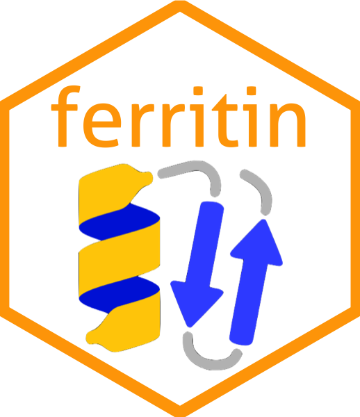

:::: {.columns}

::: {.column width="20%"}

:::

::: {.column width="75%" style="padding-left: 20px;"}
## Ferritin

Protein utilities for Rust
:::

::::

** Please note that ferritin is alpha-stage software and can change it's API at any time **

## Crates

### Ferritin-Core

Data structures and algorithims to work with proteins. [rust-docs](https://ferritin-bio.github.io/ferritin/doc/ferritin_core/). [source](https://github.com/zachcp/ferritin/tree/main/ferritin-core).

### Ferritin-MolViewSpec

Utilities for consuming and creating [molviewspec files](https://molstar.org/mol-view-spec/).  [rust-docs](https://ferritin-bio.github.io/ferritin/doc/ferritin_molviewspec/index.html). [source](https://github.com/ferritin-bio/ferritin/tree/main/ferritin-molviewspec).

### Ferritin-ONNX-Models

Access to protein PLM via the ONNX runtime. [rust-docs](https://ferritin-bio.github.io/ferritin/doc/ferritin_onnx_models/index.html). [source](https://github.com/ferritin-bio/ferritin/tree/main/ferritin-onnx-models).

### Ferritin-PLMs

Utilities for working with protein language models. [rust-docs](https://ferritin-bio.github.io/ferritin/doc/ferritin_plms/index.html). [source](https://github.com/ferritin-bio/ferritin/tree/main/ferritin-plms).

### Ferritin-Structure-Mesh

Conversion of protein structures for use in [Bevy](https://bevyengine.org), [Rerun](https://rerun.io)  or other Rust Viz tools.  [rust-docs](https://ferritin-bio.github.io/ferritin/doc/ferritin_structure_mesh/index.html). [source](https://github.com/ferritin-bio/ferritin/tree/main/ferritin-structure-mesh).
